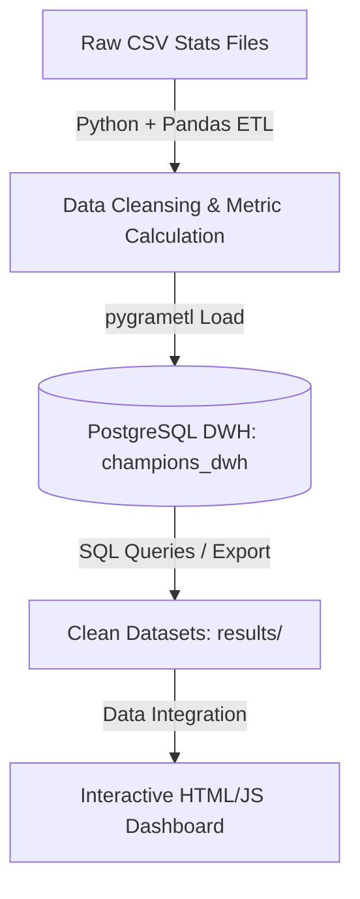

# UEFA Champions League 2021-22 | Data Warehouse & Analytics

*Ce projet a été réalisé dans le cadre du module **Modélisation Multidimensionnelle (MMD)**.*  
*This project was developed for the **Multidimensional Modeling** course.*

---

## 📌 Project Overview
This project implements an end-to-end **Business Intelligence (BI) and Data Warehousing (DWH)** solution to analyze player and team performances during the **UEFA Champions League 2021-2022** season. 

It covers the complete data lifecycle:
1. **ETL (Extract, Transform, Load):** Processing dirty CSVs, resolving anomalies, and calculating advanced performance metrics in Python.
2. **Data Warehousing:** Designing a dimensional Star Schema database in PostgreSQL.
3. **Analytics & Intelligence:** Developing mathematical scores to rank players (Player of the Season) and identify market transfer candidates.
4. **Interactive Dashboard:** Building a modern, dark-themed dashboard using vanilla JavaScript and Chart.js for data visualization.

---

## 🏗️ Architecture



### 1. Data Ingestion & ETL (`etl/etl_pipeline.py`)
The Python ETL pipeline cleans 8 dirty source datasets (goals, attempts, disciplinary records, goalkeeping, etc.). It addresses:
* **Anomaly Removal:** Filtering negative distances, impossible playing times (>1170 mins), and invalid goalkeeper stats.
* **Imputation & Deduplication:** Standardizing positions (Forward, Midfielder, Defender, Goalkeeper) and replacing missing records with column medians.
* **Advanced Metrics:**
  * Goals / Assists / Points per 90 minutes.
  * Pass Completion % and Goalkeeper Save Rate.
  * **POTS Score (Player of the Season):** A composite rating computed as:
    $$\text{POTS} = (\text{Goals} \times 2) + \text{Assists} + \frac{\text{Tackles Won}}{10} + \frac{\text{Pass Accuracy}}{10} + \frac{\text{Distance Covered}}{10}$$

### 2. Database Dimensional Modeling (`sql/create_tables.sql`)
The PostgreSQL schema follows a star schema design optimized for analytical queries:
* **`dim_player`:** Contains player names and keys mapping to their club and position.
* **`dim_club`:** Clubs participating in the UCL.
* **`dim_position`:** Categorization of playing positions (Outfield vs. Goalkeepers).
* **`fact_player_season`:** Season-grain fact table housing all 30+ physical, offensive, and defensive metrics.
* **Optimizations:** Specific indices configured on `club_id`, `player_id`, and ranking scores (`goals`, `pots_score`) for optimal query execution times.

### 3. Analytics & Transfer Intelligence
* **`results/pots_top20.csv`:** Top 20 players ranked by the custom Player of the Season score.
* **`results/players_to_sell.csv`:** Identifies underperforming players based on low playing time, negative performance indices, and high disciplinary cards.
* **`results/team_weak_points.csv`:** High-level team indicators mapping out defensive vulnerabilities and passing/offensive metrics.

### 4. Interactive Dashboard (`results/ucl_dynamic_dashboard.html`)
A standalone web application built with **HTML5, Vanilla CSS (dark glassmorphic design), and Chart.js** displaying:
* **KPIs:** Overview cards containing general stats.
* **Rankings:** Interactive tables with paginated list views of Goalscorers, Assist Leaders, and Goalkeepers.
* **Team Analysis:** Head-to-head radar comparisons of team characteristics (Attacking force, defensive strength, passing quality, discipline, etc.).
* **Scatter Plots:** Interactive correlation chart mapping Minutes Played vs. Output (Goals + Assists).

---

## 🚀 Setup & Execution

### Prerequisites
* Python 3.8+
* PostgreSQL database server
* Python packages: `pandas`, `numpy`, `psycopg2`, `pygrametl`

### Installation
1. Clone this repository:
   ```bash
   git clone https://github.com/your-username/ucl-multidimensional-modeling.git
   cd ucl-multidimensional-modeling
   ```
2. Set up the database:
   * Create a PostgreSQL database named `champions_dwh`.
   * Execute the schema script:
     ```bash
     psql -U postgres -d champions_dwh -f sql/create_tables.sql
     ```
3. Run the ETL pipeline:
   * Open `etl/etl_pipeline.py` and update the `DB_CONFIG` credentials with your local PostgreSQL configuration.
   * Run the script:
     ```bash
     python etl/etl_pipeline.py
     ```

4. Open the dashboard:
   * Open `results/ucl_dynamic_dashboard.html` in any modern web browser to view the interactive charts.

---

## 🎓 Academic Context
This project was carried out as part of the **Modélisation Multidimensionnelle** course. The final academic report detailing the functional requirements, ETL strategies, and BI results is available in the root directory:
* Report (PDF): [Rapport final MMD.pdf](Rapport%20final%20MMD.pdf)
